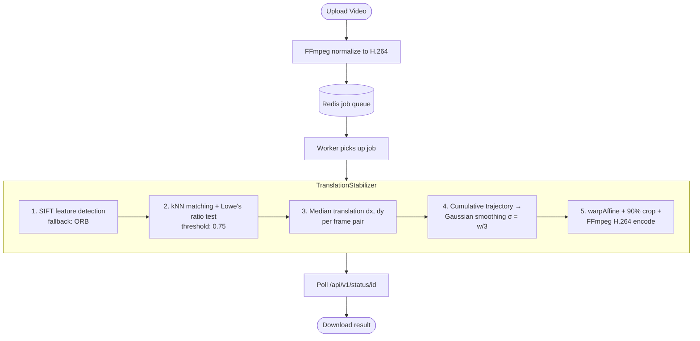
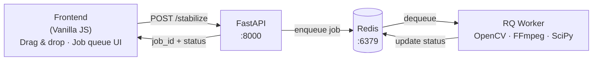

# Cricket Video Stabilizer

A web service that removes camera shake from cricket footage using computer vision. Upload a shaky clip, get back a stabilized video — processing runs asynchronously in the background so the UI stays responsive.


---

## How It Works

The stabilization pipeline runs entirely on CPU using classical computer vision — no deep learning required.



**Key design choices:**
- **Translation-only correction** — ignores rotation intentionally. Rotation correction on handheld cricket footage causes a spinning artifact that looks worse than the original shake.
- **Gaussian smoothing on trajectory** rather than individual frames — smooths the *path* the camera took, not each frame in isolation, which produces natural-looking motion.
- **Lowe's ratio test** filters out ambiguous feature matches before computing displacement, reducing noise in the translation estimate.
- **Median (not mean) displacement** per frame makes the estimate robust to outlier keypoints (e.g., a moving batsman in the foreground).

---

## Architecture



The API and worker are decoupled — the API queues jobs and returns immediately, while the worker processes videos independently. Job state is persisted in Redis so status survives API restarts.

---

## Tech Stack

| Layer | Technology |
|---|---|
| API | FastAPI + Uvicorn |
| Job Queue | Redis + RQ (Redis Queue) |
| Stabilization | OpenCV (SIFT / ORB), NumPy, SciPy |
| Video I/O | FFmpeg, OpenCV VideoCapture |
| Frontend | Vanilla JS, HTML/CSS |
| Containerization | Docker, Docker Compose |

---

## API

| Method | Endpoint | Description |
|---|---|---|
| `POST` | `/api/v1/stabilize` | Upload a video, returns `job_id` |
| `GET` | `/api/v1/status/{job_id}` | Poll job status (`queued` → `processing` → `completed`) |
| `GET` | `/api/v1/video/raw/{filename}` | Stream original video |
| `GET` | `/api/v1/video/processed/{filename}` | Stream stabilized video |

**Upload example:**
```bash
curl -X POST http://localhost:8000/api/v1/stabilize \
  -F "file=@shaky_cricket.mp4"
# {"job_id": "abc-123", "status": "queued"}
```

**Poll status:**
```bash
curl http://localhost:8000/api/v1/status/abc-123
# {"job_id": "abc-123", "status": "completed", "output_video": "abc-123_stabilized.mp4"}
```

---

## Running Locally

**Prerequisites:** Docker and Docker Compose

```bash
git clone https://github.com/Nishith-2711/Cricket_video_stabilization
cd Cricket_video_stabilization
docker compose up --build
```

Open [http://localhost:8000](http://localhost:8000) in your browser.

**Without Docker:**

```bash
# Terminal 1 — Redis
docker run -p 6379:6379 redis:alpine

# Terminal 2 — API
pip install -r requirements.txt
uvicorn api.main:app --reload

# Terminal 3 — Worker
rq worker video-processing --url redis://localhost:6379
```

Supported input formats: `.mp4`, `.avi`, `.mov`

---

## Project Structure

```
├── api/
│   ├── main.py          # FastAPI routes
│   ├── stabilizer.py    # TranslationStabilizer (core CV logic)
│   ├── worker.py        # RQ job handler
│   └── redis_queue.py   # Queue + job state helpers
├── frontend/
│   ├── index.html
│   ├── script.js        # Upload, polling, side-by-side playback
│   └── styles.css
├── docker-compose.yml
├── Dockerfile
└── requirements.txt
```
