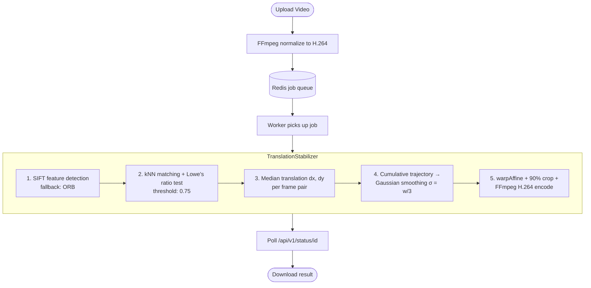
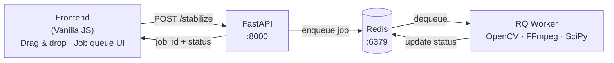
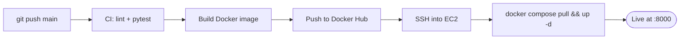

# Cricket Video Stabilizer

[](https://github.com/Nishith-2711/Distributed-Video-Stabilization-Service-for-Sports-Broadcast-Enhancement/actions/workflows/ci.yml)
[](https://github.com/Nishith-2711/Distributed-Video-Stabilization-Service-for-Sports-Broadcast-Enhancement/actions/workflows/deploy.yml)

A web service that removes camera shake from cricket footage using computer vision. Upload a shaky clip, get back a stabilized video — processing runs asynchronously in the background so the UI stays responsive.

**Live demo:** [http://18.119.12.199:8000](http://18.119.12.199:8000) — running on a single AWS EC2 instance; may occasionally be down for redeploys or if the instance is stopped to save free-tier hours.

---

## How It Works

The stabilization pipeline runs entirely on CPU using classical computer vision — no deep learning required.


```mermaid
flowchart TD
    A([Upload Video]) --> B[FFmpeg normalize to H.264]
    B --> C[(Redis job queue)]
    C --> D[Worker picks up job]

    D --> TS

    subgraph TS[TranslationStabilizer]
        S1[1. SIFT feature detection<br/>fallback: ORB]
        S2[2. kNN matching + Lowe's ratio test<br/>threshold: 0.75]
        S3[3. Median translation dx, dy<br/>per frame pair]
        S4[4. Cumulative trajectory →<br/>Gaussian smoothing σ = w/3]
        S5[5. warpAffine + 90% crop +<br/>FFmpeg H.264 encode]
        S1 --> S2 --> S3 --> S4 --> S5
    end

    TS --> F[Poll /api/v1/status/id]
    F --> G([Download result])
```

**Key design choices:**
- **Translation-only correction** — ignores rotation intentionally. Rotation correction on handheld cricket footage causes a spinning artifact that looks worse than the original shake.
- **Gaussian smoothing on trajectory** rather than individual frames — smooths the *path* the camera took, not each frame in isolation, which produces natural-looking motion.
- **Lowe's ratio test** filters out ambiguous feature matches before computing displacement, reducing noise in the translation estimate.
- **Median (not mean) displacement** per frame makes the estimate robust to outlier keypoints (e.g., a moving batsman in the foreground).

---

## Architecture


```mermaid
graph LR
    F["Frontend<br/>(Vanilla JS)<br/>Drag & drop · Job queue UI"]
    A["FastAPI<br/>:8000"]
    R[("Redis<br/>:6379")]
    W["RQ Worker<br/>OpenCV · FFmpeg · SciPy"]

    F -->|"POST /stabilize"| A
    A -->|"enqueue job"| R
    A -->|"job_id + status"| F
    R -->|"dequeue"| W
    W -->|"update status"| R
```

The API and worker are decoupled — the API queues jobs and returns immediately, while the worker processes videos independently. Job state is persisted in Redis so status survives API restarts.

---

## Tech Stack

| Layer | Technology |
|---|---|
| API | FastAPI + Uvicorn |
| Job Queue | Redis + RQ (Redis Queue) |
| Stabilization | OpenCV (SIFT / ORB), NumPy, SciPy |
| Video I/O | FFmpeg, OpenCV VideoCapture |
| Frontend | Vanilla JS, HTML/CSS |
| Containerization | Docker, Docker Compose |
| CI/CD | GitHub Actions |
| Cloud | AWS EC2 |

---

## API

| Method | Endpoint | Description |
|---|---|---|
| `POST` | `/api/v1/stabilize` | Upload a video, returns `job_id` |
| `GET` | `/api/v1/status/{job_id}` | Poll job status (`queued` → `processing` → `completed`) |
| `GET` | `/api/v1/video/raw/{filename}` | Stream original video |
| `GET` | `/api/v1/video/processed/{filename}` | Stream stabilized video |

**Upload example:**
```bash
curl -X POST http://localhost:8000/api/v1/stabilize \
  -F "file=@shaky_cricket.mp4"
# {"job_id": "abc-123", "status": "queued"}
```

**Poll status:**
```bash
curl http://localhost:8000/api/v1/status/abc-123
# {"job_id": "abc-123", "status": "completed", "output_video": "abc-123_stabilized.mp4"}
```

---

## Testing

Unit and integration tests live in `tests/test_stabilizer.py` and run against the real stabilization code — no fixture videos required, since the integration test generates a synthetic clip in-memory. Covers the translation estimation math (including robustness to outlier feature matches), Gaussian trajectory smoothing, and a full end-to-end `stabilize()` run.

```bash
pip install pytest
pytest tests/ -v
```

8 tests, all passing against `api/stabilizer.py`.

---

## CI/CD & Deployment

Every push runs the **CI** workflow (`.github/workflows/ci.yml`): installs dependencies, lints with `ruff`, and runs the full pytest suite.

Every push to `main` additionally runs the **Deploy** workflow (`.github/workflows/deploy.yml`):
1. Builds the Docker image (with GitHub Actions layer caching)
2. Pushes it to Docker Hub
3. SSHs into a production AWS EC2 instance and redeploys via `docker compose pull && up -d`

End-to-end, a push to `main` is live on AWS in well under a minute, with no manual deployment steps.


```mermaid
flowchart LR
    A[git push main] --> B[CI: lint + pytest]
    B --> C[Build Docker image]
    C --> D[Push to Docker Hub]
    D --> E[SSH into EC2]
    E --> F[docker compose pull && up -d]
    F --> G([Live at :8000])
```

**Infrastructure:** a single AWS EC2 instance (Ubuntu, t3.micro) runs the three-container stack (`api`, `worker`, `redis`) via `docker-compose.prod.yml`, which pulls the prebuilt image from Docker Hub rather than building on the instance itself. Security group restricts inbound traffic to port 8000 (the app) and port 22 (SSH management).

---

## Running Locally

**Prerequisites:** Docker and Docker Compose

```bash
git clone https://github.com/Nishith-2711/Distributed-Video-Stabilization-Service-for-Sports-Broadcast-Enhancement.git
cd Distributed-Video-Stabilization-Service-for-Sports-Broadcast-Enhancement
docker compose up --build
```

Open [http://localhost:8000](http://localhost:8000) in your browser.

**Without Docker:**

```bash
# Terminal 1 — Redis
docker run -p 6379:6379 redis:alpine

# Terminal 2 — API
pip install -r requirements.txt
uvicorn api.main:app --reload

# Terminal 3 — Worker
rq worker video-processing --url redis://localhost:6379
```

Supported input formats: `.mp4`, `.avi`, `.mov`

---

## Project Structure

```
├── api/
│   ├── main.py          # FastAPI routes
│   ├── stabilizer.py    # TranslationStabilizer (core CV logic)
│   ├── worker.py        # RQ job handler
│   └── redis_queue.py   # Queue + job state helpers
├── frontend/
│   ├── index.html
│   ├── script.js        # Upload, polling, side-by-side playback
│   └── styles.css
├── tests/
│   └── test_stabilizer.py  # pytest suite (unit + integration)
├── .github/
│   └── workflows/
│       ├── ci.yml        # lint + test on every push
│       └── deploy.yml    # build, push, deploy to AWS on push to main
├── docker-compose.yml       # local dev (builds image locally)
├── docker-compose.prod.yml  # production (pulls prebuilt image, used on EC2)
├── Dockerfile
└── requirements.txt
```
